# 🏓 pong-online

## Development

```sh
# Install deps
pnpm i

# Deploy backend resources to dev environment
pnpm deploy:backend # -> prints API endpoint url

# Create .env
cd frontend/app
cp .env.default .env # <- write API endpoint url & key

# Run frontend
pnpm dev

# Optionally, you can deploy your frontend build onto dev s3 bucket
pnpm deploy:frontend
```

## Deployment / CICD

You can basically deploy to your AWS environment by selecting `test` or `prod` as `sam deploy --config-env` just as same as `dev` environment.

To setup CICD, follow steps below. 

### Prerequisite: Create Github Connection

Go to AWS console -> Pipeline -> Settings -> Create connection

Select your repository & create connection. Copy the connection ARN. 

### Deploy Pipeline and other resources

Once Github connection is created, deploy pipeline by running:

```sh
sam deploy 
    \--config-env pipeline 
    \--parameter-overrides ConnectionArn=GITHUB_CONN_ARN,FullRepositoryId=<username>/<repository_name>
```

### Pipeline overview

The entire stages and actions are as follows:

```mermaid
flowchart TD
  subgraph Source
    ConnectionArn
  end
  subgraph Build
    BuildStack
  end
  subgraph Test
    deployStackTest(DeployStack)
    buildFrontTest(BuildFrontEnd)
    test(TestApplication)
    deployTest(DeployFrontEnd)
    
    BuildArtifactAsZip --> deployStackTest
    deployStackTest --stack info --> buildFrontTest
    buildFrontTest --build--> test
    buildFrontTest --build--> deployTest
  end
  subgraph Deploy
    deployStackProd(DeployStack)
    buildFrontProd(BuildFrontEnd)
    deployProd(DeployFrontEnd)
    deployStackProd --stack info --> buildFrontProd
    buildFrontProd --build--> deployProd
  end
  Source --✅--> Build
  Build --✅--> Test
  Test --✅--> Deploy
```


